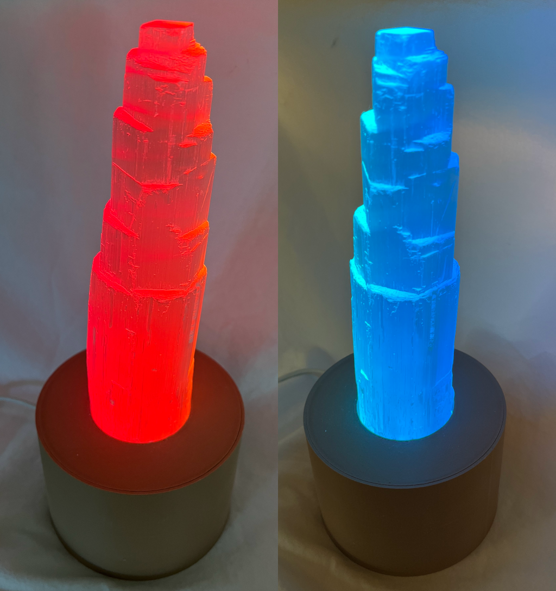
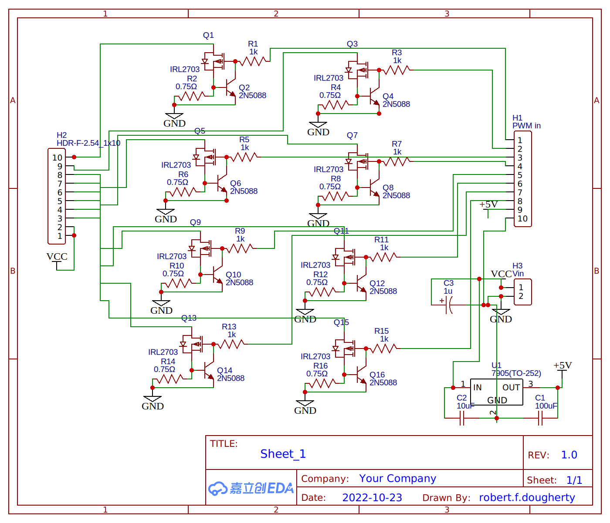
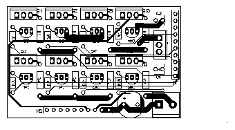

# glowstick

An 8-channel high power LED driver for light-art projects. This work was inspired by a [project](https://github.com/rfdougherty/ledFlicker) that I built many years ago to do visual experiments in an MRI scanner. Some [old python code from that work](https://github.com/vistalab/vistadisp/tree/master/ledFlicker/python) might be useful. E.g., here's [code](https://github.com/vistalab/vistadisp/blob/master/ledFlicker/python/ledFlickComputeXform.py) to compute human cone LMS stimulation from LED color power spectra.

## Hardware

The LED drivers use a simple [constant-current driver](https://www.instructables.com/Power-LED-s---simplest-light-with-constant-current/) with the LED current determined by a current-sense resistor Rcs. The LED current is approximately equal to 0.5 / Rcs and the power dissipated by the resistor is approximately 0.25 / Rcs. In the schematic here, I set Rcs to 0.75Ω to achieve an LED current of about 0.67A, safely under the 700mA rating for the [Luxeon Rebel LEDs](https://luxeonstar.com/wp-content/uploads/documentation/ds68.pdf) that I used. With this value, Rcs will dissipate up to 333mW, so be sure to use at least a 1/2W resistor. The MOSFETs will also dissipate some power, with the amount a function of the LED power and the voltage difference between the source supply and the LED forward voltage. E.g., if the LEDs are drawing 700mA at a Vf of 3V using a 5V supply, the MOSFETs will dissipate about 2*0.7=1.4W. At these levels, the MOSFETs will get quite hot and should be attached to a small heatsink. While not nearly as efficient as a buck driver, this driver circuit is simple, reliable, and cheap.

Note that to consistently drive the LEDs at or near 700mA you will also need adequate thermal management for the LED module. From the LuxeonStar site:
> A suitable finned heatsink or other cooling method must always be used with the SP-02 LED module to ensure that the junction temperature of the LEDs is kept well below the maximum rating specified in the Lumileds datasheet. The size of the heatsink will depend on the ambient temperature and the current used to power the LEDs. Bench testing that we have conducted with SP-02 modules powered at 700mA in an open-air environment and an ambient temperature of 25°C has indicated that a heat sink with a thermal rating of 9 C°/W or lower should be adequate.

The schematic and layout was designed in [EasyEDA](https://easyeda.com/) and the [EasyEDA json files](hardware/) are included. After getting the board made and testing it, I realized that I forgot to add pull-down resistors to keep the LEDs off when the microcontroller is not connected or is rebooting. For my build, I squeezed 10kΩ resistors in with the 1kΩ resistor leads and the ground end of the 0.75Ω resistor leads. But it would be best to update the schematic to include these pull-downs.

The circuit includes a voltage regulator so a microcontroller can be powered by the LED supply. If you use a 5V supply and your microcontroller has a 5V input, then you can omit the voltage regulator and just add a bypass wire. Or, you could populate it with a 3.3V regulator if your input supply is less than 5V but greater than 3.3V. Also, as noted above, the power dissipation of the MOSFETs is affected by the voltage difference between the source supply and the LED forward voltage. So you could make it more efficient by using a supply that is closer to the maximum LED forward voltage. Just be sure to account for the 0.5V dropout in the circuit. E.g., if you are using LEDs with a Vf of no more than 3.2V, then you could use a 3.7V supply to get the best efficiency.

I used a [Wemos S3 Mini](https://www.wemos.cc/en/latest/s3/s3_mini.html) for the microcontroller.

## Firmware

The firmware is written in C/C++ using [Arduino](https://www.arduino.cc/) and the [aWOT framework](https://github.com/rbaron/aWOT). Note that I used a 7-LED module for my build, so the firmware currently only supports 7 channels. If you do use the 8th channel, you will need to update the firmware.

The code runs a web server with the following API endpoints:

- `GET /config` - Retrieve the current configuration as JSON
- `POST /config` - Update the configuration (expects JSON payload)
- `GET /leds` - Get the current LED PWM values for all 7 channels
- `PUT /leds/:l0/:l1/:l2/:l3/:l4/:l5/:l6` - Set the LED PWM values (0-255 for each channel)
- `PUT /iscale/:v` - Set the intensity scale (0.0-1.0)
- `PUT /mod/:amp/:step` - Set modulation parameters (amplitude and step, 0.0-1.0)
- `PUT /update/:v` - Set update interval (10-9999999 microseconds)
- `GET /sensors` - Get sensor data (temperature, time, LED states)
- `GET /reboot` - Trigger system reboot

TODO:
- Add a web GUI to allow easy configuration
- MQTT support
- Add timer functions, including sunrise/sunset support
- Add LED spectra (measured or from the datasheet) and allow HSV color control

## Enclosure

An enclosure for the pcb, microcontroller module, and a 7-chip [LuxeonStar](https://luxeonstar.com/) LED module was designed in [OpenSCAD](https://www.openscad.org/). The LEDs illuminate a large [selenite](https://en.wikipedia.org/wiki/Selenite_(mineral)) tower crystal. The LED module that I used had the following chips [custom-mounted to a 40mm round FR4 Coolbase board](https://luxeonstar.com/product/sp-02/):
 * Royal-Blue - 1030 mW (LXML-PR02-A900)
 * Blue - 74 lm (LXML-PB02)
 * Cyan - 122 lm (LXML-PE01-0070)
 * Green - 161 lm (LXML-PM01-0100)
 * Lime - 313 lm (LXML-PX02-0000)
 * Amber - 137 lm (LXM5-PL01)
 * Deep Red - 655nm/640 mW (LXM3-PD01)

The LEDs were diffused with a [Polymer Optics 12° 39 mm Circular Beam Diffused Optic](https://luxeonstar.com/product/264/).

